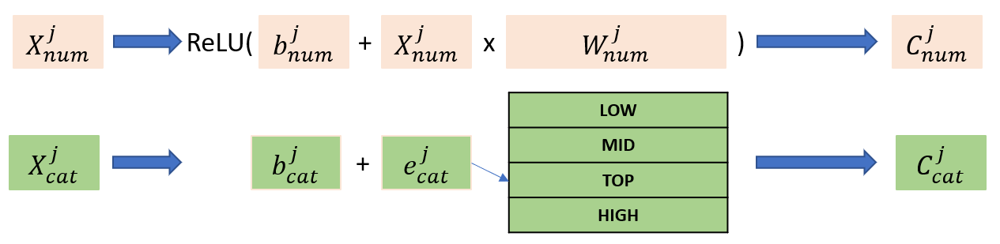

# Interaction Network Contextual Embedding (INCE)

Simple implementation of INCE, the algorithm described in _"Graph Neural Network Contextual Embedding for
Deep Learning on Tabular Data"_

## Model Description

INCE is a Deep Learning (DL) model for tabular data that employs Graph Neural Networks (GNNs) and, more specifically, 
Interaction Networks for contextual embedding.

First an encoder model
maps each tabular dataset feature into a latent vector or
embedding and then a decoder model takes the embeddings
and uses them to solve the supervised learning task.
The encoder model is composed by two components: the
columnar and the contextual embedding. The decoder model is
given by a Multi-Layer Perceptron (MLP) tuned to the learning
task to solve


_COLUMNAR EMBEDDING:_ All features
(categorical and continuous) are individually projected
in a common dense latent space.



_CONTEXTUAL EMBEDDING:_ The features obtained from columnar 
embedding are organized in a fully-connected graph with
an extra virtual node, called CLS as in BERT. Then,
a stack of Interaction Networks models the relationship
among all the nodes - original features and CLS virtual
node - and enhances their representation. The resulting
CLS virtual node is sent into the final classifier/regressor


Schematic workflow of Interaction Network


## Main Results

INCE has been tested on the benchmark described in the table below:


and compared with the following baselines: 

_Standard methods_: Linear Model, KNN, Decision Tree, Random
Forest, XGBoost, LightGBM, CatBoost. 

_Deep learning models_: MLP , DeepFM, DeepGBM, RLN, TabNet, 
VIME, TabTrasformer, NODE, Net-DNF, SAINT, FT-Transformer.

(See the paper for details and references)

The main results are summarized in table and plot shown below:


## How to use the code

Requirements: 
```bash
numpy==1.23.5
pandas==1.5.2
scikit-learn==1.1.3
torch==1.13.0+cu117
torch-cluster==1.6.0+pt113cu117
torch-geometric==2.2.0
torch-scatter==2.1.0+pt113cu117
torch-sparse==0.6.15+pt113cu117
torch-spline-conv==1.2.1+pt113cu117
tqdm==4.64.1
```

Train/Test INCE on California Housing dataset: 

```python
python main.py TODO
```